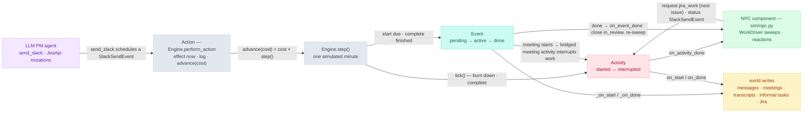

# Architecture

How the Project Manager Simulation is put together, and the systems decisions it
turns on. For the quick tour (layout, schema map), see the
[README](../README.md#architecture-at-a-glance); this is the deeper reference.

## Layers

The package is a small stack; arrows point at dependencies (lower layers know
nothing of higher ones):

```
env      facade: one handle over a run (owns store + sim kernel)
  ├─ sim    dynamics: clock, engine (event queue + minute loop), durative events, calendar,
  │         activities, and the NPC component (sim/npc.py — WorkDriver + reactions)
  ├─ jira   Jira-style issue tracker over the Store (its own issue tables)
  ├─ npc    coworker roster + persona presets (cast.py, persona.py)
  └─ db     persistence: sqlite connection, schema.sql, the typed Store
        └─ world   domain layer: Pydantic entities (models.py) + read view (resources.py)
```

`world` depends on nothing; `db` maps rows ↔ `world` models; `sim`/`jira`/`npc`
act through `db`; `env` assembles them.

## How simulated time advances

Time is an integer **tick** — one tick = one simulated minute — stored in
`meta.current_tick`. It is part of the single source of truth (survives
save/resume) and is **decoupled from wall-clock**: an agent action may cost many
ticks regardless of how long inference took.

`SimClock` (`pm/sim/clock.py`) models a **work-hours calendar**: 09:00–17:00 on
weekdays, 480 ticks/day, **2400 ticks/week** (tick 0 = Mon 09:00, 2400 = Fri
17:00). Nights don't exist — 17:00 rolls straight into the next 09:00, so a delay
that crosses 5pm lands the next morning.

The engine advances **one minute at a time**:

- `Engine.step()` bumps the clock by 1, then **ticks activities first** (work
  ending at this minute completes before anything that begins at it — a
  zero-slack schedule would otherwise strand a minute at every meeting
  boundary), then starts due events and completes finished ones.
- `Engine.advance(n)` / `advance_to(tick)` loop `step()`.
- `Simulation.run(on_tick=…)` (`pm/sim/simulation.py`) drives a whole Mon 09:00 →
  Fri 17:00 week, calling an optional per-minute hook before each step.

The **sync/async seam** is `Engine.perform_action(actor, cost, effect)`: the
effect (an agent's tool mutation) runs at the *current* tick with no time passing,
then `advance(cost)` lets background events start/complete during that window.
Nothing runs on a real thread — the week is driven entirely by the clock.

## How world state is stored

**SQLite is the single source of truth.** Each run is one `runs/<id>/world.db`,
plus an immutable `runs/<id>/seed.db` snapshot taken at `Env.make` — the basis for
reproducible replays (`Env.reset`) and diffable grading (seed → current).

All access goes through **`Store`** (`pm/db/store.py`), the only place raw SQL
lives. It maps `sqlite3.Row` objects ↔ the Pydantic entities in
`pm/world/models.py`, and during a run the engine is the **sole writer**. The DDL
is `pm/db/schema.sql` — including the informal `task` table, a meeting-notes
mirror of Jira (see [Meetings, transcripts & informal
tasks](#meetings-transcripts--informal-tasks)); the Jira board adds its own
`issue` / `issue_dependency` tables via `pm/jira/repository.py` (idempotent
`CREATE TABLE IF NOT EXISTS`, no edit to the core schema). Because state is plain SQLite plus an append-only
`event_log` trace, any run is auditable with the stock `sqlite3` CLI.

## Operator surface (scenario-keyed)

The CLI (`pm/cli.py`) is deliberately narrow: `sim`, `eval`, and `viz` each take a
single `--scenario`, and **the scenario name is the run id and the output folder**.
There is no persona or run-id flag — **each scenario module bakes in its own
personas** (`build(member_persona=…)` defaults, applied via
`pm/npc/cast.py::with_personas`), so `pm sim --scenario X` alone reproduces that
scenario's documented outcome. One scenario → one run.

Everything a scenario produces lives under **`runs/<scenario>/`**, the self-contained
result bundle:

- `world.db`, `seed.db` — from `sim` (the finished world + its immutable seed).
- `eval.json` — from `eval` (`to_dict(report)`, written alongside the printed report).
- `calendars.html`, `jira_tasks.html` — from `viz` (static HTML/SVG, no JS/browser).

`pm/scenarios/runner.py::drive` is the shared driver used by both `pm sim` and the
catalog test. It builds a `WorkDriver`, installs it as the `ActivityManager`'s
completion hooks (`on_activity_done` for finished activities, `on_event_done`
for the standup/Slack closes), sweeps once at kickoff, and runs the week with an
`on_tick` that carries only the optional PM review hook (`agent_review_hook`) —
then fires a final PM close-out. The registered scenarios and their
verified outcomes are cataloged in
[`pm/scenarios/scenarios.md`](../pm/scenarios/scenarios.md).

## Meetings, transcripts & informal tasks

**Every meeting leaves a transcript.** When a `MeetingEvent` completes
(`pm/sim/events.py::MeetingEvent._on_done`; the activity path in
`pm/sim/activity.py` gives the same guarantee), the engine writes a `Transcript`
row with `available_tick = now` — empty body unless the payload carries
`transcript_body`. `available_tick` gates discoverability:
`AgentTools.read_transcripts` only surfaces transcripts of meetings that have
already ended.

The same `_on_done` upserts **informal tasks**: each entry in the meeting
payload's `tasks` list becomes a row in the `task` table (`Task` in
`pm/world/models.py`, written via `Store.upsert_task` / read via `list_tasks`) —
a meeting-notes mirror of Jira carrying an id, title, DRI, and
`todo | in_progress | done` status. An update merges with the existing row and
preserves `source_meeting_id` and `created_tick`, so work can be created,
handed off, and closed entirely inside meetings without a Jira ticket ever
being filed.

The `team_no_jira` scenario is built on that split. The "Meeting Transcripts v1"
brief ships with three board-sized task breakdowns — `pm/transcript/project_{team,
two_engineers,single_engineer}.md`, same project and scope, different work tasks —
parsed by `pm/transcript/__init__.py::project_tasks(board)`. The team breakdown
(`NOTES-1…25`, each with DRI, status, and estimate) drives `team_no_jira`.
`pm/scenarios/project_board.py::seed_project_board(env, jira_ids=…)` adds the
project row and files Jira tickets **only for the selected ids** —
`team_no_jira` files none (the board stays empty all week) — while the full
breakdown always reaches the `task` table through the Monday kickoff's payload,
and the later standups' payloads advance the statuses. So `read_jira_board` can look empty
or healthy while the transcripts and the `task` table hold the real project —
and `pm eval` (`pm/eval/report.py`) grades "every project task done" from the
informal table, falling back to the board's leaf `task` issues only when a run
has no informal tasks (hours stay Jira-sourced).

## Events, actions & activities — how they trigger each other

Three moving parts share the one clock, and each fires the others:

- **Activity done → NPC behavior → next activity or event.** NPC work runs as
  `jira_work` **activities**; nothing polls. When an activity completes,
  `ActivityManager` fires its `on_activity_done` hook, where the
  `WorkDriver` (`pm/sim/npc.py` — behavior and reactions are one component
  inside the sim) sweeps the roster: every member with
  nothing in flight picks their next issue per their persona and **requests a
  new activity** (one completion can unblock anyone, so the sweep covers
  everyone) — and an `announces_progress` persona also **triggers an event**
  (a `SlackSendEvent` status post). Interrupted work needs no hook at all:
  re-dispatch resumes it with its remaining minutes intact. The only other
  dispatch is the **kickoff** — one sweep at week start.
- **Action → events.** An action (`Engine.perform_action`) is the synchronous
  lever: its effect lands at the *current* tick, then `advance(cost)` loops
  `step()`. The LLM agent's one mutation, `send_slack`, uses its tool to
  **trigger an event** — the effect schedules a `SlackSendEvent`, which lands
  through the event pipeline during the cost window (the same path NPC
  messages take, so world reactions fire for it too).
- **Event done → reactions.** When `step()` completes an event, the close
  reactions fire (`WorkDriver.on_event_done`, installed as the Engine's
  event-completion hook — the NPC component never touches the `Simulation`
  loop): a Slack send schedules a `slack.read` for each person named, a
  seeded-random 1–60 minutes later; a standup ending — or a person reading a
  message that names them — closes their `in_review` work, then re-sweeps the
  driver so newly unblocked dependents dispatch immediately. A "pick up"
  directive, taken at read time, preempts the ticket being worked (the
  directed one runs just above normal work priority; the interrupted ticket
  resumes afterwards).
- **Meetings preempt work.** A `MeetingEvent`'s `_on_start` requests an
  bridged `meeting` activity (priority 100; `event_id` in its params makes
  the kind's effects no-op) for its attendees,
  which interrupts their `jira_work` (40); `OOOEvent` bridges the same way at
  priority 200. One `started` activity per NPC attender is exactly what
  interrupt/resume arbitrates.



The cycle to notice is the rose↔green loop: a finished activity wakes the
`WorkDriver`, whose sweep requests the next activities (and status events).
Agent actions don't touch that loop directly — they buy the sim-time in which
it runs, and steer it only through the Slack levers the reactions implement.

## How events are scheduled

Every asynchronous activity is one durative **`Event`** (`pm/sim/events.py`) with a
uniform lifecycle:

```
pending ──start()──▶ active ──done()──▶ done        (+ cancelled)
```

There is exactly **one row per event** in the `event` table, and that table *is*
the queue — indexed `(status, start_tick, seq)`, with **no parallel in-memory
heap**. `Engine.schedule(event)` (`pm/sim/engine.py`) stamps a monotonic
`seq` (resumed past the persisted max so it's never reused) and `created_tick`,
then persists via `Store.upsert_event`. Global order is therefore
`(start_tick, seq)` — deterministic across replays and resumes.

Dispatch is purely clock-driven: each `Engine.step()` (after ticking activities)
**starts** every pending event whose `start_tick` has arrived and **completes**
every active event whose duration has elapsed. Behaviour lives on the `Event` subclass (`_on_start` /
`_on_done`) — the engine just moves rows through `start() → done()`; the
subclasses apply the world mutation through `engine.store`. Instantaneous events
have `duration == 0` and start and finish in the same tick.

## Contention & interruption

An NPC can only do one thing at a time, and a meeting must win over routine work.
Two cooperating mechanisms enforce this; both express the same rule — **higher
priority preempts, and preempted work pauses and resumes** — at different moments.
The activity manager is the live path for NPC work; the calendar governs the
durative *events* (meetings, OOO, and generator-produced `JiraTicketEvent`s).

### Calendar reservation (event level, at schedule time)

`pm/sim/calendar.py::reserve` is called from `Engine.schedule` for *occupying*
(durative) event types. Priority is by type — a meeting (`MEETING`, 100)
outranks work (`JIRA_TICKET`, 20). The `occupancy` table is
the materialized per-NPC calendar of `[start, end)` blocks. On reserve:

- **Yield:** a new block is pushed to start after any equal-or-higher block it
  overlaps for its people.
- **Bump:** it then displaces every lower-priority block it overlaps. A bumped
  event that is **not yet started** is moved to begin after the new window; one
  that is **already active pauses and resumes** — its `duration` is extended by the
  meeting's length, so it finishes later having "lost" the meeting's minutes.

Because this all happens at reserve time, the engine then just runs events on the
resolved schedule.

### Activity manager (runtime, per NPC)

`pm/sim/activity.py::ActivityManager` is the richer, runtime model of *doing*. An
**Activity** (meeting, jira_work, write_doc, review_doc, slack_send/read,
coffee_break, …) runs with
a state machine:

```
backlogged → started → (interrupted ↔ started) → done      (+ cancelled)
```

The manager enforces **one `started` activity per attender**. Each tick it burns
down started activities and re-dispatches. When a higher-priority activity claims
an attender who is mid-work, the lower-priority one is **interrupted** — its
`remaining` is frozen — and it **resumes** (re-`started`) once the attender is free
again. So a coworker heads-down on a ticket, pulled into a meeting, pauses the
ticket and picks it back up afterward with exactly the work that was left. If an
attender is already in an equal-or-higher activity, the incoming one waits
(`backlogged`). Priority is the only per-kind knob (plus the `on_start`/`on_done`
effect hooks).

The two mechanisms meet at the **bridge**: `MeetingEvent._on_start` requests an
`meeting` activity (100) for its attendees — `event_id` in its params makes
the kind's effects no-op, so the event stays the single writer of the meeting,
transcript, and informal-task rows — and
`OOOEvent._on_start` an `ooo` activity (200), so calendar events preempt
activity work exactly as they preempt event work. When an activity completes,
the manager fires its `on_activity_done` hook — the seam where the
`WorkDriver` re-sweeps the roster (see the trigger section above).
